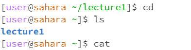
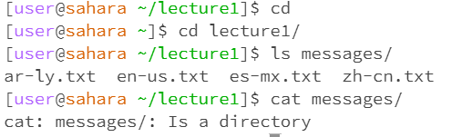

# ***Lab Report 1***
***

* For the cd command it change the directory and /lecture1 was no longer the directory. The cd command with no argumants puts you in the home directory, user@sahara~. There was no error.
* For the ls command it was in the user@sahara~ directory. The ls command only gave me the lecture1 in the list of files because there are no other files in that directory. There was no error
* For the cat command it was in the user@sahara~ directory. The cat command returned blank lines when no arguments were passed through since it is supposed to return whatever is in a file. There was no error.
***

* For the cd command it started in the home directory. The cd command changed the directory form the home to lecture1/ when lecture1/ was passed through. There was no error.
* For the ls command it started in the lecture1/ directory. The ls command returned the list in messages when messages/ directory was passed through. There was no error.
* For the cat command it started in the lecture1/directory. The cat command returned messages/ saying that it was a directory. I assume this was an eror because the cat command returns what is in a file and it did not do that in this case.
***
!
