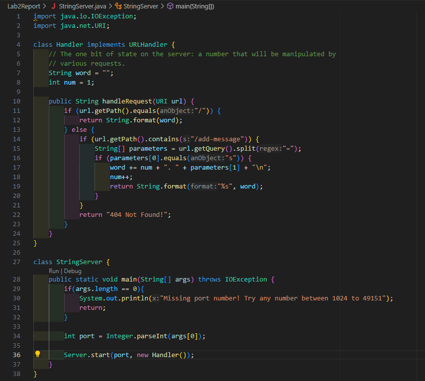
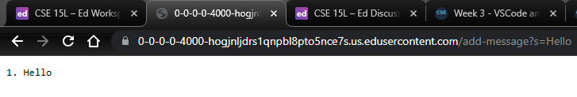
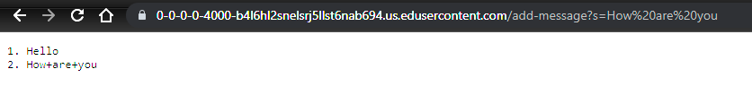
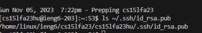
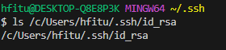
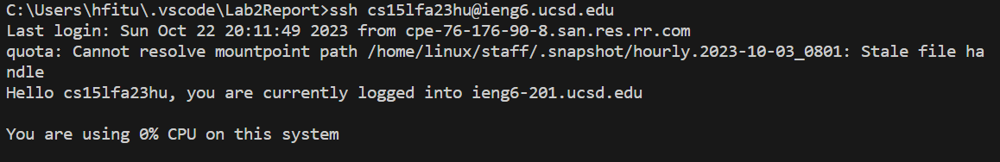

# ***Lab Report 2***
***
Part 1
-------------------

* In the first screenshot, we call the handleRequest methand. The first if statement is checked and we see that the url.getPath().equals("/") is nto true and it goes to the else statement. It then checks url.getPath().contains("/add-message") to make sure that we are using add-message and sees that it's true. Then we use getQuery().split for our array called parameter and we check to see if the first element in the array is equal to s using the .equals method. Since we are adding the word into our sting, the string will be modified with new word and the end it will be printed using the String.format() by passing "%s" to print as a string and the string variable itself. The empty string variable now has hello in it and it will be printed to the screen.
* In the second screenshot, we call the handleRequest methand. The first if statement is checked and we see that the url.getPath().equals("/") is not true and it goes to the else statement. It then checks url.getPath().contains("/add-message") to make sure that we are using add-message and sees that it's true. Then we use getQuery().split for our array called parameter and we check to see if the first element in the array is equal to s using the .equals method. Since we are adding the word into our sting, the string will be modified with new word and the end it will be printed using the String.format() by passing "%s" to print as a string and the string variable itself. The string will have both words and it will print them out on the screen. The string just had "hello" in it but now it also has the "how are you" message but it had + instead of a space separating it and it is printed on a new line.

---
Part 2
----------------

---
Part 3
-----------
I learned that you can make a key with ssh-keygen. The key used can also allow you to connect to a remote server without a password. I also learned that there is
