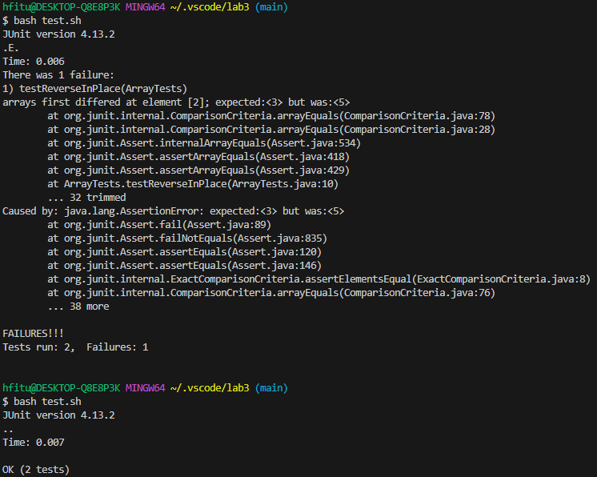

# ***Lab Report 3***

## Part 1
---

Failure-inducing Input
```
@Test 
public void testReverseInPlace() {
    int[] input1 = { 3, 4, 5 };
    ArrayExamples.reverseInPlace(input1);
    assertArrayEquals(new int[]{ 5,4,3 }, input1);
	}
```
Input that doesn't induce a failure
```
@Test 
	public void testReverseInPlace() {
    int[] input1 = { 3 };
    ArrayExamples.reverseInPlace(input1);
    assertArrayEquals(new int[]{ 3 }, input1);
	}
```
Test results for both inputs



Before
```
static void reverseInPlace(int[] arr) {
    for(int i = 0; i < arr.length; i += 1) {
      arr[i] = arr[arr.length - i - 1];
    }
  }
```
After
```
static void reverseInPlace(int[] arr) {
    for(int i = 0; i < arr.length/2; i += 1) {
      int temp = arr[i];
      arr[i] = arr[arr.length - i - 1];
      arr[arr.length - i - 1] = temp;
    }
  }
```
The problem with the code was that it was not storing the number that was getting changed. When the number needs to be swapped later on, the number will be the same since no value was being stored. In the fix, I store the value before it's swapped and after the value gets swapped, I swap the value at the other end of the array with the value stored.


## Part 2
---

I chose less for my command and I found all the options related to it on this website:
https://www.geeksforgeeks.org/less-command-linux-examples/#

-p
```
$ less -p "hi" biomed/
biomed/ is a directory
```
```
$ less -p "hi" -N  biomed/1468-6708-3-1.txt
 14         with moderately high BMI had little or no extra risk except
     15         in certain small subsets. A review of 13 studies of older
     16         adults drew similar conclusions [ 7 ] .
     17         Many healthy older adults report gradual weight gain
     18         throughout adult life. It may be that a small amount of
     19         gradual weight gain is normative and associated with the
     20         most robust health as we age. It has been suggested that
     21         weight standards be adjusted upwards for age [ 8 ] . Such
     22         recommendations remain controversial, however, because the
     23         number of studies of older persons is fairly small, and
     24         because few studies have examined the relation of BMI to
     25         quality of life or years of healthy life (YHL) in the
     26         elderly [ 9 ] .
```
```
less -p "hi" biomed/1468-6708-3-1.txt

with moderately high BMI had little or no extra risk except
        in certain small subsets. A review of 13 studies of older
        adults drew similar conclusions [ 7 ] .
        Many healthy older adults report gradual weight gain
        throughout adult life. It may be that a small amount of
        gradual weight gain is normative and associated with the
        most robust health as we age. It has been suggested that
        weight standards be adjusted upwards for age [ 8 ] . Such
        recommendations remain controversial, however, because the
        number of studies of older persons is fairly small, and
        because few studies have examined the relation of BMI to
        quality of life or years of healthy life (YHL) in the
        elderly [ 9 ] .
        In older adults, risk factors may have a greater effect
```
The -p commnad takes a string and will start the file from the fist point that the string was found. The string can be part of a word and doesn't have to be an actual word in the file such as "hi" started at the word "high". This command is useful if there is a specific part of the file that talks about a specific subject and you would like to find where that is. We can also see that useing -N will allow us to see the line that the first case is found.

-E
```
$ less -E 911report/chapter-1.txt
"WE HAVE SOME PLANES"

    Tuesday, September 11, 2001, dawned temperate and nearly cloudless in the eastern United States. Millions of men and women readied themselves for work. Some made their way to the Twin Towers, the signature structures of the World Trade Center complex in New York City. Others went to Arlington, Virginia, to the Pentagon. Across the Potomac River, the United States Congress was back in session. At the other end of Pennsylvania Avenue, people began to line up for a White House tour. In Sarasota, Florida, President George W. Bush went for an early morning run.

    For those heading to an airport, weather conditions could not have been better for a safe and pleasant journey. Among the travelers were Mohamed Atta and Abdul Aziz al Omari, who arrived at the airport in Portland, Maine.

INSIDE THE FOUR FLIGHTS
```
```
$ less -E -s 911report/chapter-1.txt
"WE HAVE SOME PLANES"

   "WE HAVE SOME PLANES"

    Tuesday, September 11, 2001, dawned temperate and nearly cloudless in the eastern United States. Millions of men and women readied themselves for work. Some made their way to the Twin Towers, the signature structures of the World Trade Center complex in New York City. Others went to Arlington, Virginia, to the Pentagon. Across the Potomac River, the United States Congress was back in session. At the other end of Pennsylvania Avenue, people began to line up for a White House tour. In Sarasota, Florida, President George W. Bush went for 
an early morning run.

    For those heading to an airport, weather conditions could not have been better for a safe and pleasant journey. Among the travelers were Mohamed Atta and Abdul Aziz al Omari, who arrived at the airport in Portland, Maine.

INSIDE THE FOUR FLIGHTS

Boarding the Flights

    Boston: American 11 and United 175. Atta and Omari boarded a 6:00 A.M. flight from Portland to Boston's Logan International Airport
```
```
$ less -E 911report/
911report/ is a directory
```
The -E command for less exits when the entire file is read. This command can be useful if you just want to proofread a file once or if you were going to just read/skim over a long file. With the use of -s option you can also minimize the number of blank spaces in the file by removing consecutive blank lines.

*-i
```
$ less -i government/
government/ is a directory
```
```
less -i 911report/Chapter-1.txt
"WE HAVE SOME PLANES"

    Tuesday, September 11, 2001, dawned temperate and nearly cloudless in the eastern United States. Millions of men and women readied themselves for work. Some made their way to the Twin Towers, the signature structures of the 
World Trade Center complex in New York City. Others went to Arlington, Virginia, to the Pentagon. Across the Potomac River, the United States Congress was back in session. At the other end of Pennsylvania Avenue, people began to line up for a White House tour. In Sarasota, Florida, President George W. Bush went for an early morning run.  
```
```
$ less -i -S 911report/Chapter-1.txt
"WE HAVE SOME PLANES"

    Tuesday, September 11, 2001, dawned temperate and nearly cloudless in the eastern United States. Million>

    For those heading to an airport, weather conditions could not have been better for a safe and pleasant j>

INSIDE THE FOUR FLIGHTS

Boarding the Flights

    Boston: American 11 and United 175. Atta and Omari boarded a 6:00 A.M. flight from Portland to Boston's >

    When he checked in for his flight to Boston
```
The -i command ignores casing when looking at files. This could be good if you were trying to find a file name but you don't know the exact casing on the file. With the -S added to the -i you can also truncate lines instead of wrapping.

-s
```
$ less -s biomed/
biomed/ is a directory
```
```
$ less -s biomed/1468-6708-3-1.txt
Introduction
Older adults are frequently counseled to lose weight,      
even though there is little evidence that overweight is    
associated with increased mortality in those over age 65.  
Six large controlled population-based studies of
non-smoking older adults have investigated the association 
between body mass index (BMI) and mortality, controlling
```
```
$ less -s -N  biomed/1468-6708-3-1.txt
1
      2
      3
      4
      5         Introduction
      6         Older adults are frequently counseled to lose weight,
      7         even though there is little evidence that overweight is
      8         associated with increased mortality in those over age 65.
      9         Six large controlled population-based studies of
     10         non-smoking older adults have investigated the association
     11         between body mass index (BMI) and mortality, controlling
     12         for relevant covariates [ 1 2 3 4 5 6 ] . All studies found
     13         excess risk for persons with very low BMI, but that persons
     14         with moderately high BMI had little or no extra risk except
     15         in certain small subsets. A review of 13 studies of older
     16         adults drew similar conclusions [ 7 ] .
```
The -s command for less will eliminate all consecutive blank lines when the file is printed. This could be useful if you want to minimize the size of the file when you are reading it. We can see the amount of lines combined with -N after -s and we can also see that the strating lines aren't compressed.
