# ***Lab Report 4***

## Keys Pressed to Fix the Code for ListExamples
---
```
<up>
<enter>
```
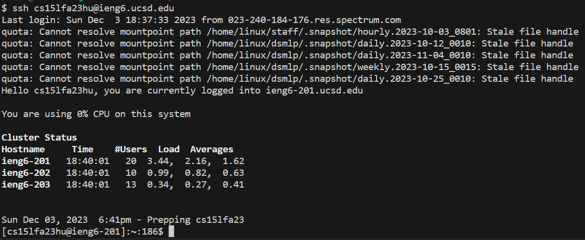
The up arrow went to the previous command and I pressed enter to execute it. Since I had to set up my ssh again it was the command I previously used.


```
git clone git@github.com:hfituri/lab7.git
<enter>
```
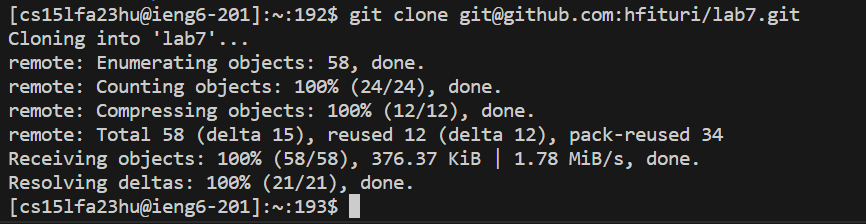

The next step I typed "git clone" and already had the ssh for the repository copied to my clipboard to I pasted it after git clone and pressed enter to execute.

```
cd l<tab>
<enter>
```
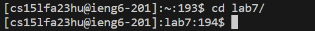

In this step, we changed our directory to lab7 and used tab to finish the word instead of typing it out.

```
bash test.sh
<enter>
```
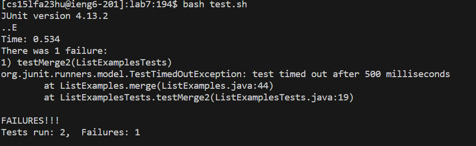

This step required us to run our test to make sure that it initially failed and used tab, like the previous step, to autofill.
  
```
vim L
<tab>
.
<tab>
<enter>
```
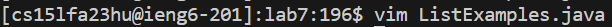

We opened up vim in this step and used <tab> like previous steps to auto complete.

```
6<up> 
<down> 
13<right> 
<left> 
i 
<backspace> 
2 
<Esc> 
:wq!
<enter>
```
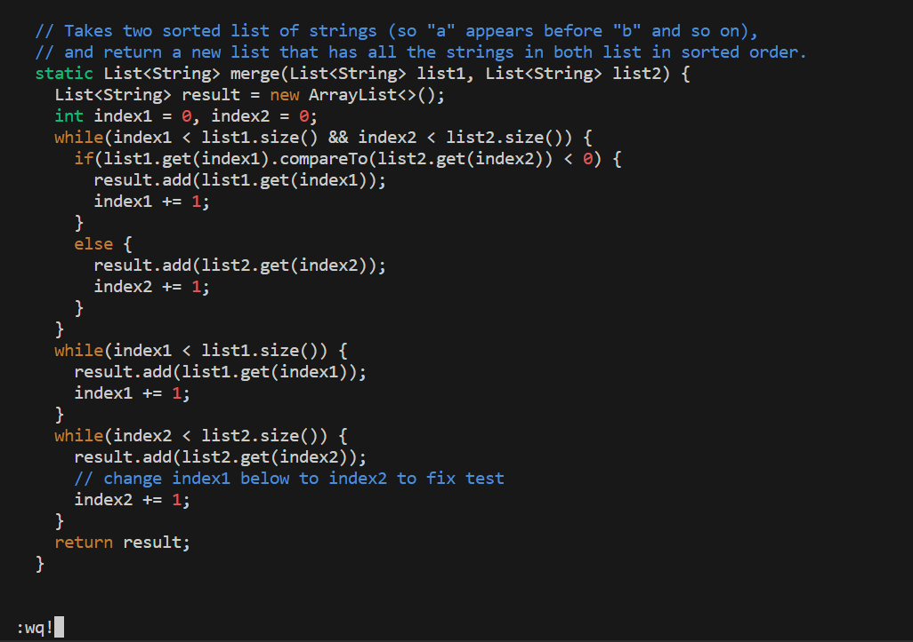

For this step, we were in vim and needed to make the necessary changes to the code. I went 6 up, one down, 13 to the right, one to the left, and then I entered 'i' to enter insert mode and change "index1" to "index2" and saved and exited using ":wq!". Using a number before pressing the arrow key allows you to go that many spaces in that dierection.

```
<up>
<up>
<enter>
```
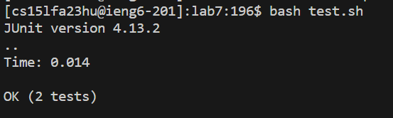

Since I have already used this command before, I can access it by using the up arrow key twice and pressing enter.

```
git add L
<tab>
<enter>
```
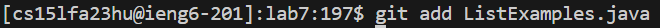

In this step, we added the the file that is to be changed in github.

```
git commit
<enter>
```
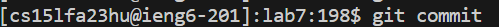

This step we committed the code that we wanted to be change in github.

```
i 
Changed index1 to index2
<Esc>
:wq!
<enter>
```
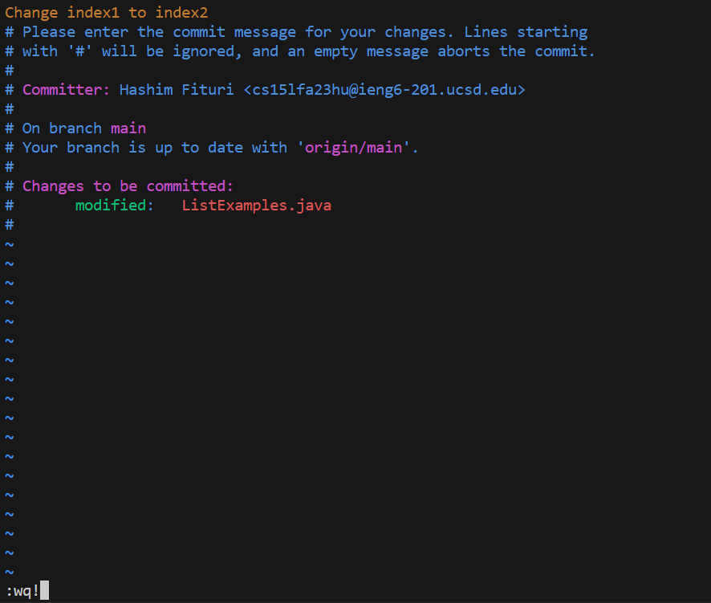

In this step, we wrote down the commit message and then I saved and quit using :wq!.

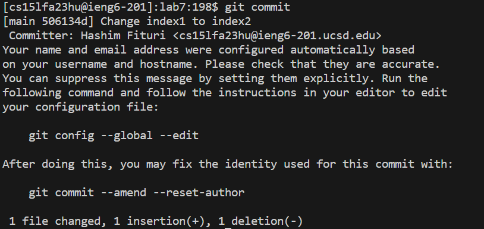

```
git push 
<enter>
```
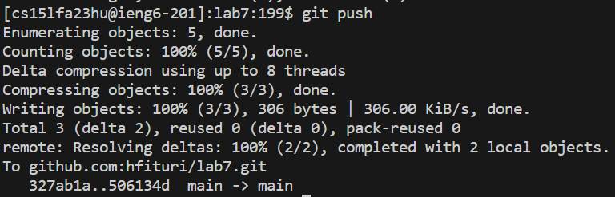

As the final step, we pushed our changes into github and now are changes can be seen there.


