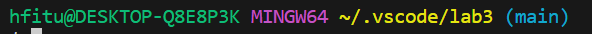

# ***Lab Report 5*** 
## Putting it All Together

## Part 1 - Debugging Scenario

Poe: Hi, I have been having problems running the bash script for my code. It says that my tests pass but also says that my code fails. I know the code has something to do with the reversed function in my code but I don't know what's causing the error


TA: I see that it says your code is unreachable and it is caused by something previous in the method before it. It has something to do with your code ending before the statement is reach or you code not ending at all. I would suggest to look at the line directly before the error as that is most likely where you will find the bug.

Poe: Thanks for the tip. I realized that the failure-inducing input was that the loop in my method was always true which caused the code to never be reached.


The files and directory:




The code before the fix:


Bash script to trigger the error:


How to fix the bug:

To fix this bug we have to change the condition in the while loop. The while loop right now has true as the condition we need to change it to `c < arr.length` so that the loop can end. With this change now we are able to reach the return statement.

The change would look like:
```
static int[] reversed(int[] arr) {
    int[] newArray = new int[arr.length];
    int c = 0;
    while(c < arr.length) {
      arr[c] = newArray[arr.length - c - 1];
      c++;
    }
    return arr;
  }
```
This is how the code would look after the changes.

This is the now fixed code:


## Part-2 Reflection

Something I learned in the second half of this class was how to use the jdb debugger from the terminal. It was the first time I used a debugger from the terminal so it was interesting to learn how it worked. I learned how to access the variables from commands as well as stopping threads which I didn't know was possible with debuggers. I also thought that the different shortcuts using VIM was very helpful since it made just going throught VIM a lot easier.
